https://abdesign38-jpg.github.io/PRODUCT-RESEARCH/docs/prototypes/sitelift-watchfloor.html 

https://abdesign38-jpg.github.io/PRODUCT-RESEARCH/ 

https://improved-train-gxx6w7qqp5p6fv6r7-8000.app.github.dev/prototypes/Guided%20Patrol%20Copilot%20_Generic.html

Applied Operational Intelligence
Product, research, risk, engineering and AI — explored as one system
This repository contains a set of sanitised interactive prototypes exploring the same class of operational problem at different altitudes: what happens when field activity, imperfect sensor data, human decisions, automation and AI all have to work together in a real operational environment.
These are not three disconnected UI exercises.
They are examples of a working method:
> **Observe the operational system → identify where information or authority breaks → model the risk → prototype the intervention → translate it into engineering logic → add AI only where it creates leverage without hiding uncertainty or removing accountable human judgment.**
---
What are you looking at?
Three prototypes, each focused on a different layer of the same socio-technical system.
Prototype	System altitude	Primary question	Main disciplines
Signal Confidence in the Officer's Hand	Field signal / interface	Can a small upstream intervention prevent a downstream operational false positive?	Research, product design, analysis, mobile engineering
Guided Patrol Copilot	Field workflow / human-AI interaction	How can AI help an officer execute, document and recover a patrol without becoming the decision-maker?	Product, workflow design, AI, operations, engineering
Sitelift Watchfloor	System / control-room / assurance	How should detection, uncertainty, provenance, automation and human authority interact in a higher-risk environment?	Systems research, risk, engineering, AI governance
Prototype files
`TrackingIconHandoffSanitised (1).html`
`Guided Patrol Copilot (Generic).html`
`SiteliftWatchfloor(1).html`
---
The system, not just the screen
```mermaid
flowchart LR
    A["FIELD REALITY<br/>officer · site · device · sensor"] --> B["SIGNALS<br/>GPS · time · checkpoint · evidence"]
    B --> C["ANALYSIS<br/>quality · sequence · uncertainty · context"]
    C --> D["DETERMINISTIC LOGIC<br/>states · thresholds · geometry · rules"]
    D --> E["RISK / POLICY<br/>what may automate?<br/>what must stop?<br/>what needs a human?"]
    E --> F["PRODUCT EXPERIENCE<br/>status · guidance · alerts · decision queues"]
    F --> G["AI ASSISTANCE<br/>draft · summarize · recommend · explain"]
    G --> H["HUMAN AUTHORITY<br/>confirm · reject · resolve · publish"]
    H --> I["OPERATIONAL OUTCOME"]
    I --> A
```
The prototypes move repeatedly through these layers rather than treating product, AI and engineering as separate functions.
---
How the disciplines connect
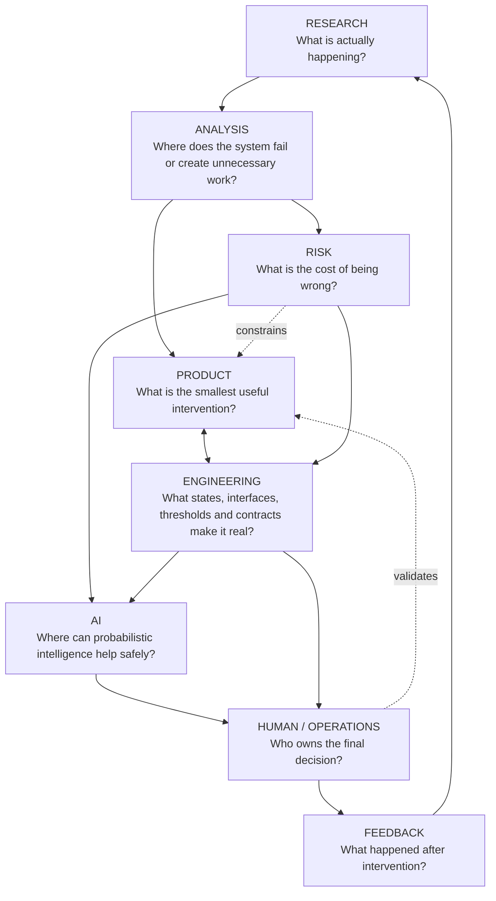
The key idea
AI is not the architecture.
AI is one layer inside a larger decision system. Before adding intelligence, the work asks:
Is the input trustworthy?
Is this a state, an event, or an inference?
What is the cost if the system is wrong?
Can the action be reversed?
Does the action increase attention or remove it?
Who should have authority at this point?
Would fixing the problem upstream eliminate the need for AI downstream?
---
Prototype 01 — Signal Confidence in the Officer's Hand
Research question
A field device can continue reporting location even when the location has become unreliable. The control room and downstream automation can see the degraded signal quality, but the person carrying the device may not.
The design study asks:
> **What if the operator who can correct the problem fastest can also see the problem first?**
The proposal is intentionally small: expose live tracking confidence in a fixed, glanceable location inside the field application.
Why this is product work, not icon work
The intervention closes an operational loop.
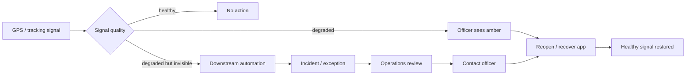
The same physical problem can therefore produce two very different operational costs.
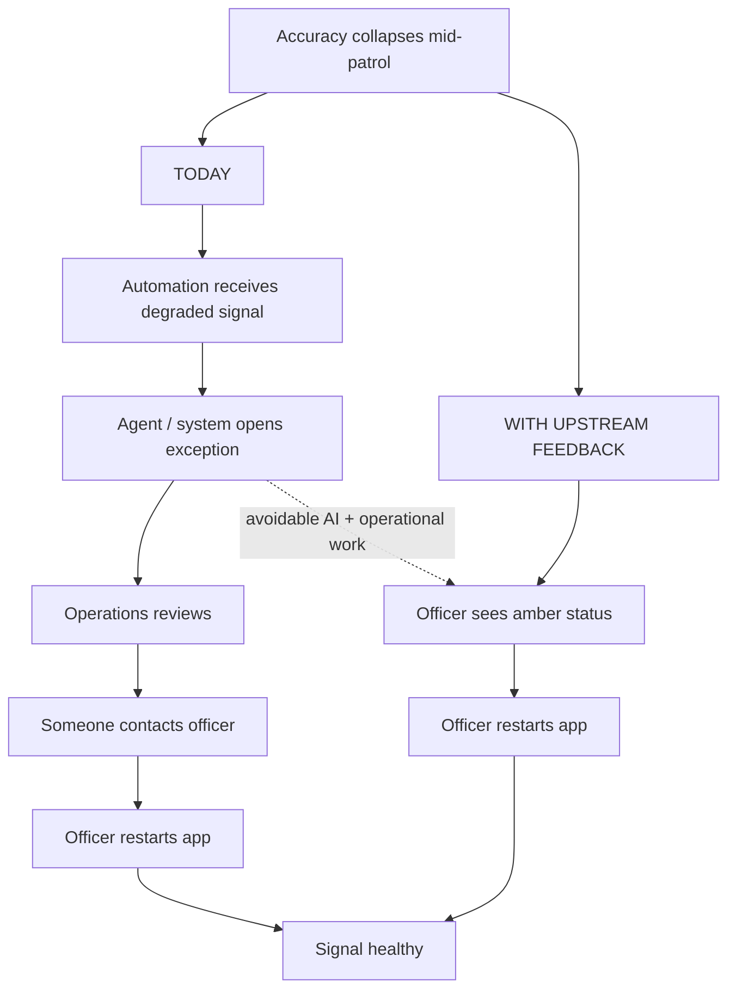
Research → engineering translation
The study tests:
three placement candidates,
four signal states,
two device profiles,
visibility and interaction constraints,
fixed-position learning,
the existing shared top-bar architecture.
The recommendation is then translated into implementation behavior: a shared tracking-status action, stable placement, distinct active / low-accuracy / not-tracking / off-shift states, and a direct path to recovery information.
What this demonstrates
Research identifies the actual failure.  
Analysis traces its downstream cost.  
Product moves feedback to the cheapest point in the loop.  
Engineering makes state and placement deterministic.  
AI risk is reduced by preventing bad input from becoming an AI problem at all.
---
Prototype 02 — Guided Patrol Copilot
Product question
How can a field application actively help an officer complete a patrol — rather than simply record whether the patrol happened?
The prototype turns patrol execution into a guided workflow:
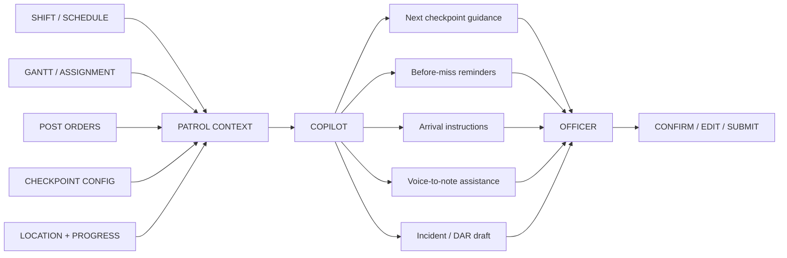
AI authority boundary
The important design decision is not simply where AI appears, but where it stops.
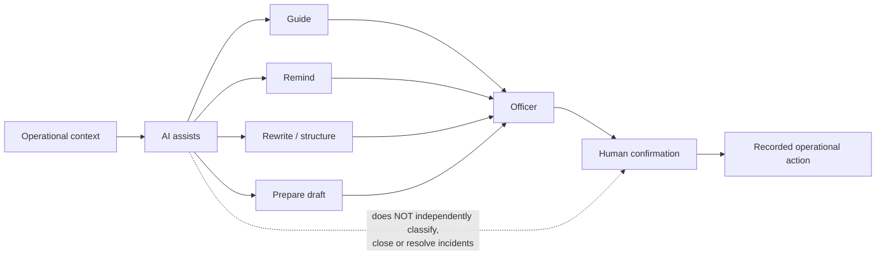
The Copilot can reduce memory load, navigation friction and documentation effort. It does not silently acquire operational authority.
Product logic
The experience connects otherwise separate operational information:
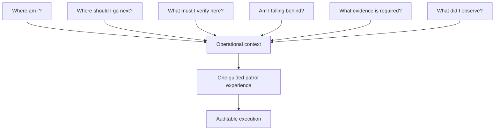
What this demonstrates
Product turns fragmented tools into an execution layer.  
Research/analysis focuses on the actual cognitive load of patrol work.  
Engineering provides route, schedule, checkpoint and evidence context.  
AI operates as a copilot: guidance, language transformation and drafting.  
Risk defines the authority boundary.  
The officer remains accountable for the operational record.
---
Prototype 03 — Sitelift Watchfloor
Sitelift moves one level deeper: from field experience into the architecture of a decision system.
It is a deterministic emulation of a perimeter automation stack, progressively adding geometry, map projection, detection, incidents, patrol logic, exposure, provenance-aware officer deconfliction and decision control.
Layered build logic
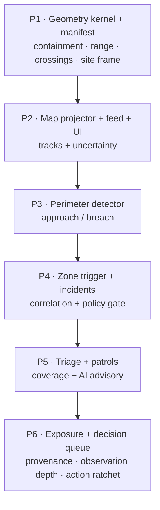
Each phase depends on the layer below it. Intelligence is added after geometry, signal handling, event logic and policy are explicit.
---
State is not the same as an event
One of the core analytical distinctions is:
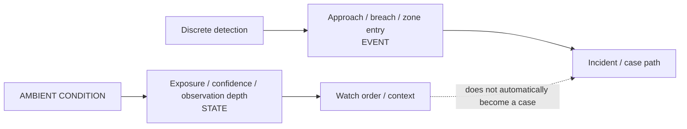
This avoids turning every weak or ambiguous signal into an operational incident.
---
Provenance-aware deconfliction
A position is not considered trustworthy merely because it contains coordinates.
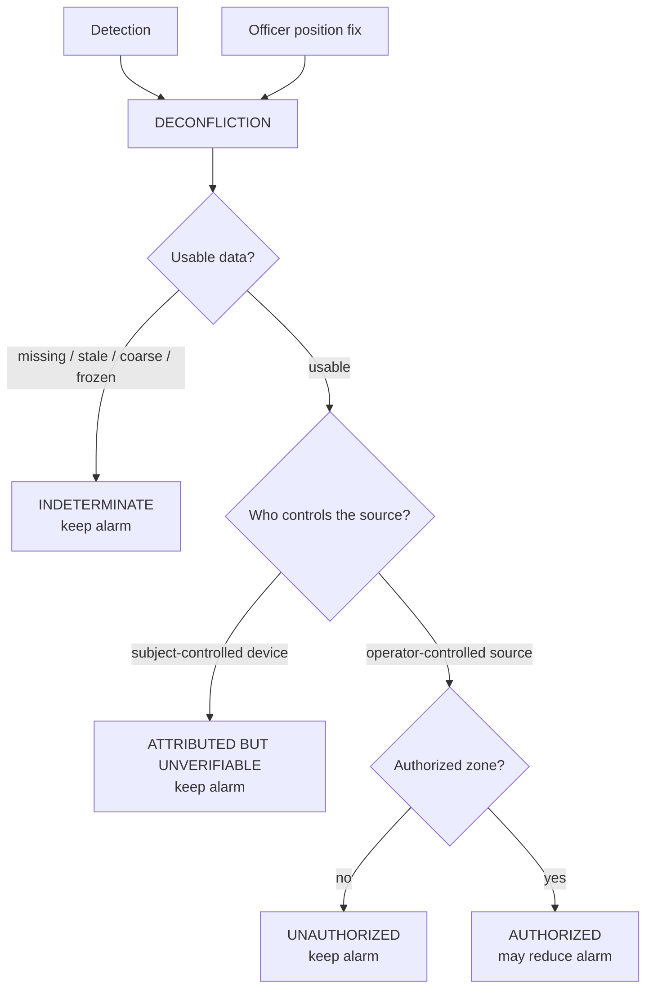
The safety property is simple:
> **A subject-controlled source may identify an officer, but it cannot by itself silence a security alarm.**
Unknown data is not treated as certainty.
---
Risk model — the action ratchet
Sitelift uses a useful authority pattern:
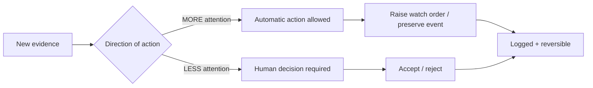
Principle
Automation may move the system toward more attention when the action is reversible.  
Reducing attention, suppressing evidence or committing resources requires stronger evidence and/or human approval.
This makes the risk boundary visible in the product instead of burying it in model behavior.
---
The three prototypes as one architecture
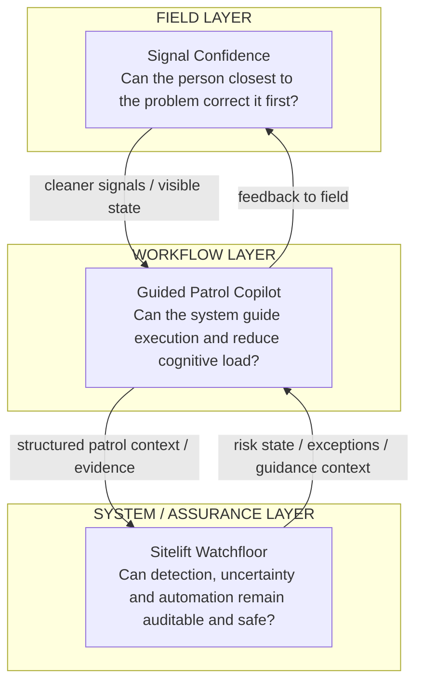
They address three different failure classes:
Failure class	Prototype response
The human cannot see what the system sees	Expose signal confidence upstream
The human has information but too much cognitive coordination is required	Add guided workflow + AI assistance
The system can act but uncertainty and authority are not explicit	Add deterministic logic, provenance, policy gates and human decision boundaries
---
Decision architecture
A useful shorthand for the overall approach:
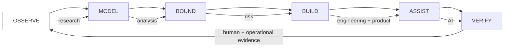
Observe — understand the real operational behavior.  
Model — make states, dependencies, uncertainty and failure paths visible.  
Bound — decide what the system may and may not do.  
Build — turn the reasoning into product and engineering contracts.  
Assist — use AI where it reduces cognitive work or transforms information.  
Verify — keep accountable human confirmation and observe the outcome.
---
Where AI belongs
Across these prototypes, AI is deliberately used for tasks such as:
contextual guidance,
reminder generation,
language refinement,
structured drafting,
triage recommendations,
explanation and summarisation.
AI is deliberately not used as a substitute for:
sensor quality validation,
deterministic geometry,
provenance,
permission and authorization logic,
silent alarm suppression,
final incident classification,
irreversible operational decisions.
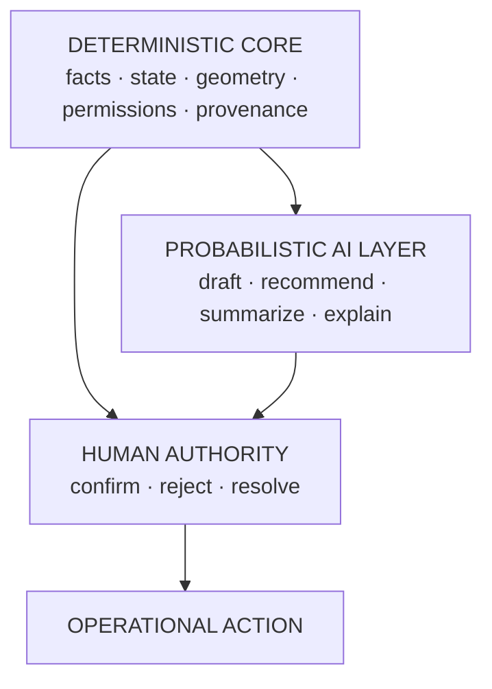
---
What this work is meant to show
The work is less about producing isolated screens and more about finding the right intervention inside a complex system.
It demonstrates the ability to move between:
product discovery,
operational research,
systems analysis,
interaction design,
risk modeling,
technical architecture,
AI product behavior,
human-in-the-loop controls,
and implementation-level constraints.
The goal is not to make every problem an AI problem.
The goal is to understand the system deeply enough to know where intelligence creates leverage, where deterministic logic is safer, where a five-second human feedback loop beats an agent, and where the cost of being wrong changes the architecture.
---
Notes
The prototypes are intentionally sanitised and use generic operational data.
They are interactive design and systems prototypes, not production deployments.
The diagrams in this README describe the logic represented across the prototypes rather than a claim that every component is deployed as a single production architecture.
